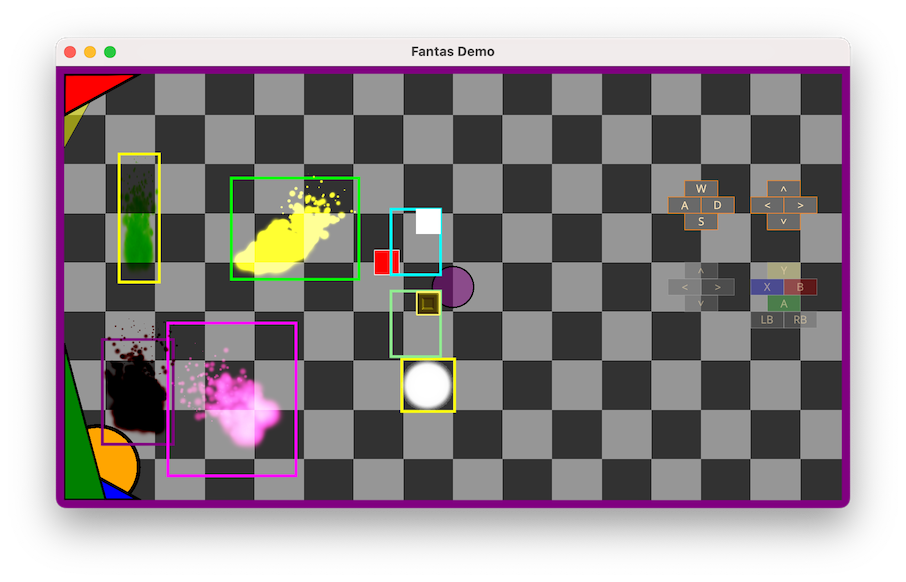

#  **Fantas**

## WARNING : Fantas is currently in preview, it shouldn't be used for production

Fantas is a 2D graphics rendering and animation framework for .NET. It is designed to make it easy for developers to create 2D games and interactive apps for Desktop and mobile devices.

Fantas uses a node-based system to create and render 2D graphics. Nodes are objects that represent a visual element or piece of content in a Fantas Scene. They can be used to create and animate sprites (2D images), display text, play sounds, and perform other actions.

Fantas also includes a physics engine that can be used to simulate realistic physics in a 2D environment, as well as a particle generator for creating special effects like explosions or particle trails.

Overall, Fantas is a powerful tool for building 2D games and interactive experiences on mobile or Desktop.

Fantas is cross platform and support Android, iOS/tvOS, macOS, Linux and Windows.

Fantas can be used to develop games on any platform that supports .NET.

The design and the architecture of Fantas were heavily influenced by other .NET libraries like WinForms and other gaming libraries like Cocos.

Fantas is commercial product, in other to use read the end user license agreemen

## Quick Start:
* [Windows](windows.md)
* [macOS](mac.md)
* [Linux](linux.md)

