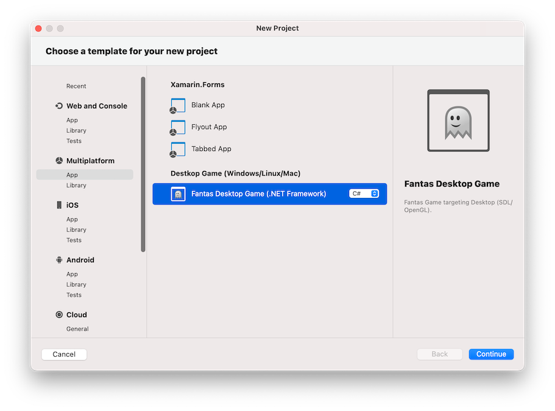

# Quick Start on Linux

## Setup development

Fantas work on Linux using modern .NET.

* [Install .NET on Linux](https://learn.microsoft.com/en-us/dotnet/core/install/linux).
* Install Fantas templates for `dotnet new`.

* Go to `Visual Studio > Extensions...` Menu option.

* Install from file... and select the `Fantas.Extension.mpack`.
## Create new project

After installing Visual Studio Mac extension, create a new project using File New Project:

The extension added options to create a new game for Desktop, macOS (native), Android, iOS and tvOS
