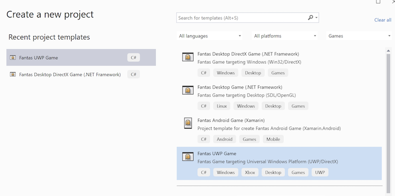

# Quick Start on Windows

## Setup development

Fantas will work with most .NET tools (Visual Studio 2017 or superior).

* The latest [Visual Studio](https://visualstudio.microsoft.com/) is recommended.
* Install [⬇ Fantas.Extension](https://github.com/codefoco/Fantas.Home/releases/download/v1.0/Fantas.Extension.vsix) for Visual Studio.

## Create new project

After installing Visual Studio extension, create a new project using File New Project:



## Or Using dotnet new command line

If you want to create new game using new .NET instead of the classic you can do from the command line:

* Install Fantas templates for `dotnet new`.

```
dotnet new install Fantas.Templates
```

This will install .NET Fantas templates, you can crate a new desktop game doing 

```
mkdir MyGame
cd MyGame
dotnet new fantas-desktop
```

This are the templates available:

```text
--------------------------------------------  --------------  --------  ---------------------------
Fantas Android Game (.NET)                    fantas-android  [C#]      android/mobile/games
Fantas Desktop DirectX Game (.NET - Windows)  fantas-directx  [C#]      desktop/games/windows
Fantas Desktop Game (.NET)                    fantas-desktop  [C#]      desktop/games/linux/windows
Fantas iOS Game (.NET)                        fantas-ios      [C#]      ios/games
Fantas macOS Game (.NET)                      fantas-mac      [C#]      macos/games
Fantas tvOS Game (.NET)                       fantas-tvos     [C#]      tvos/games
```
